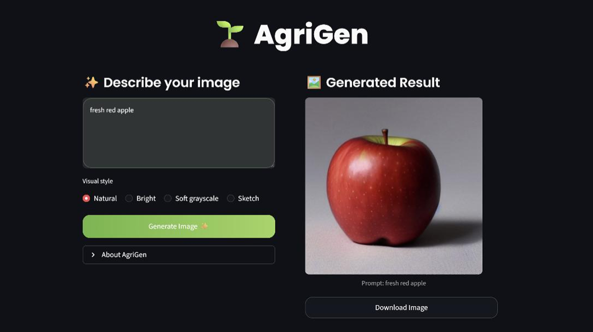
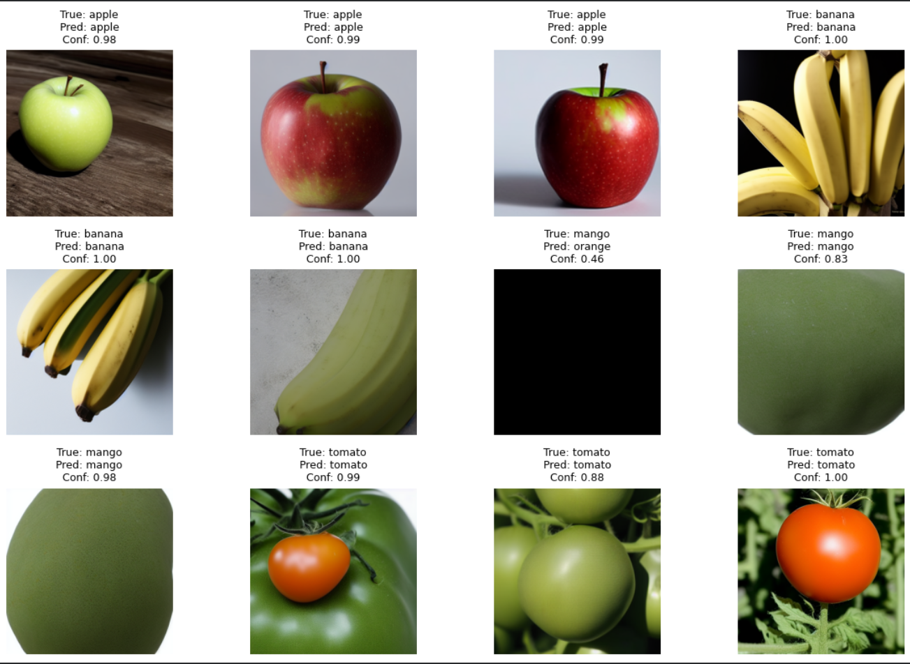
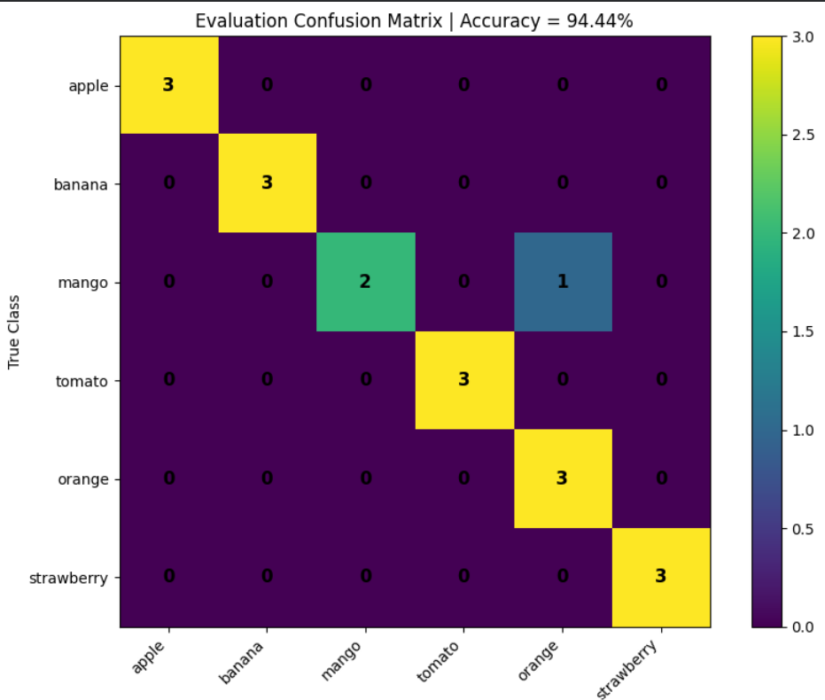
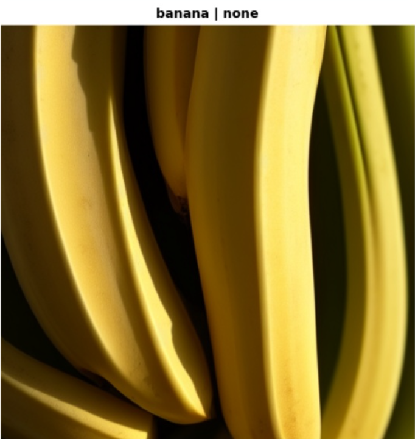
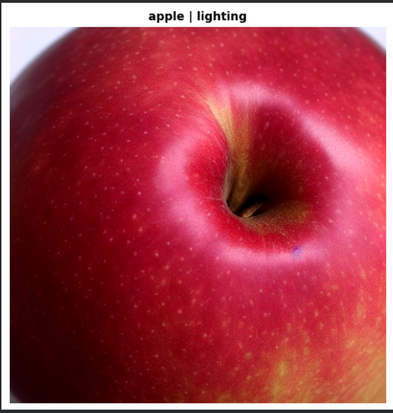
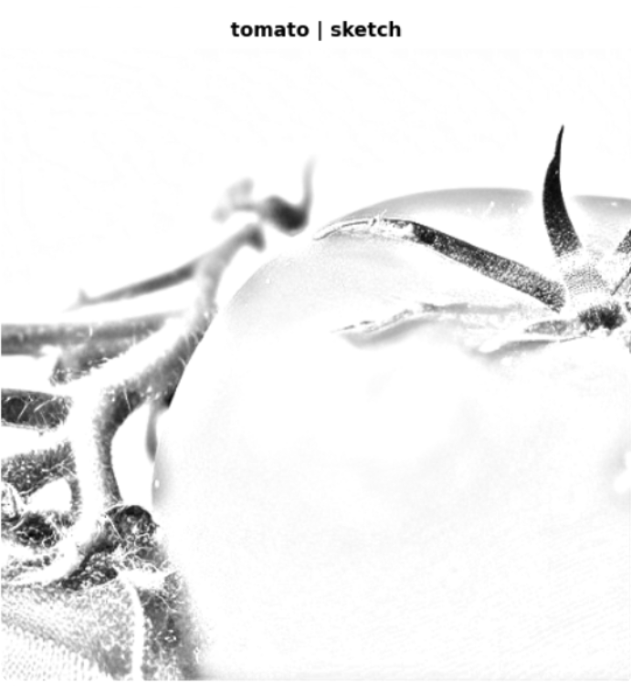

# AgriGen: Text-Guided Image Generation for Agricultural Crops

AgriGen is an integrated AI-based engineering system specialized in text-to-image generation for the agricultural domain. The project aims to overcome the limitations of closed-source commercial models by providing an open-source and interpretable solution.
The system utilizes deep learning techniques to generate high-quality images of fruits, vegetables, nuts, and seeds from simple textual descriptions.

---

## Key Features

- **Text-to-Image Generation** Generate realistic agricultural crop images from text prompts.
  
- **Latent Space Exploration** Manipulate latent representations to control image characteristics.

- **Dynamic Styling** Apply multiple visual styles such as Sketch, Lighting Enhancement, and Grayscale.

- **Interactive Web Interface** The system features a user-friendly interface built with **Streamlit**, allowing users to customize styles and generate images in real-time.

**[Try the Live Demo here!](https://spotty-tigers-stand.loca.lt)**

*Figure 1: Screenshot of the AgriGen interactive web application.*

---

## Technical Architecture

The project evolved from an initial VAE-based design into a more advanced implementation for higher image quality.

- **Base Model:** Stable Diffusion v1.5
- **Fine-Tuning Technique:** LoRA (Low-Rank Adaptation) for efficient domain-specific training.
- **Optimization:** Attention Slicing and VAE Slicing for resource-efficient inference.
- **Inference Scheduler:** DPMSolverMultistepScheduler for faster image generation.

---

## Dataset & Evaluation

The model was trained on the **Fruits-360 Dataset** and evaluated using the **CLIP model** to ensure high semantic alignment.

### Evaluation Accuracy: 94.44%

#### Visual Evaluation Samples

*Figure 2: Samples from the evaluation process showing True vs. Predicted labels.*

#### Confusion Matrix

*Figure 3: Performance breakdown across different agricultural categories.*

---

## Results Showcase (Demo)
Below are examples of images generated by AgriGen using different prompts and artistic styles:

| Prompt: "Banana" | Prompt: "Apple" | Prompt: "Tomato (Sketch)" |
| :---: | :---: | :---: |
|  |  |  |
| *Style: Natural* | *Style: Lighting Enhancement* | *Style: Artistic Sketch* |

---

